<html lang="en" xmlns="http://www.w3.org/1999/xhtml">
<head  runat="server">
    <meta charset="utf-8" />
    <title></title>
    <meta name="viewport" content="width=device-width, initial-scale=1">
    <link href="Content/bootstrap.css" rel="stylesheet" />
    
    
    

    <link href="Content/bootstrap.min.css" rel="stylesheet" />
    <link href="Content/style.css" rel="stylesheet" />
    <link href="Content/all.min.css" rel="stylesheet" />
    <link href="Content/responsive.css" rel="stylesheet" />
    <link href="Content/3wStyleSheet.css" rel="stylesheet" />
    

    <link href="vendor/owl-carousel/css/owl.carousel.min.css" rel="stylesheet" />
    <link href="vendor/owl-carousel/css/owl.theme.default.min.css" rel="stylesheet" />

    <link href="vendor/Magnific-Popup/dist/magnific-popup.css" rel="stylesheet" />

</head>
<body>

    <!--  ======================= Start Header Area ============================== -->
    <form id="form1" runat="server">
        

            <header class=" header_area">
                

                    <nav class="navbar navbar-expand-lg navbar-light">
                        <a class="navbar-brand" href="#">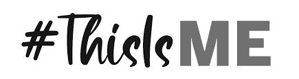</a>
                        <button class="navbar-toggler" type="button" data-toggle="collapse" data-target="#navbarNav"
                                aria-controls="navbarNav" aria-expanded="false" aria-label="Toggle navigation">
                            
                        </button>
                        

                            

                            <ul class="navbar-nav">
                                <li class="nav-item active">
                                    <a class="nav-link" href="#">Home (current)</a>
                                </li>
                                <li class="nav-item">
                                    <a class="nav-link" href="#about">about</a>
                                </li>
                                <li class="nav-item">
                                    <a class="nav-link" href="#servicesoffer">services</a>

                                </li>
                                <li class="nav-item">
                                    <a class="nav-link" href="#projects">projects</a>
                                </li>
                                <li class="nav-item">
                                    <a class="nav-link" href="#referees">referees</a>
                                </li>
                                <li class="nav-item">
                                    <a class="nav-link" href="#gallery">gallery</a>
                                </li>
                                <li class="nav-item">
                                    <a class="nav-link" href="#contact">contact</a>
                                </li>

                            </ul>
                        

                    </nav>
                

            </header>

            <!--  ======================= End Header Area ============================== -->
            <!--  ======================= Start Main Area ================================ -->
            <main class="site-main">

                <!--  ======================= Start Banner Area =======================  -->

                <section class="site-banner">
                    

                        

                            

                                <h3 class="title-text">Hey</h3>
                                <h1 class="title-text text-uppercase">I am Emmanuel</h1>
                                <h4 class="title-text text-uppercase">Finalist Mechatronics Engineering Student </h4>
                                

                                    

                                        
                                            <button onclick="document.location='mailto:manuelmisiko2@gmail.com?subject= I wish to inquire on Hiring your services'" class="btn button text-uppercase" style="color: white;">
                                                hire
                                                me
                                            </button>
                                            
                                        <button class="btn button  text-uppercase" style="color: white;">Get cv</button>
                                      
                                    

                                

                            

                            

                                
                            

                        

                        `
                    

                </section>
                

                <!--  ======================= End Banner Area =======================
   
                <!--  ========================= About Area ==========================-->

                <section class="about-area" id="about">
                    

                        

                            
                            

                                <h2 class="text-uppercase pt-5">
                                    Let me
                                    introduce
                                    myself
                                </h2>
                                
                                

                                    

                                        

                                            I'm a great fan of football, well thats a comment you wouldn't want to hear but, if i told you what
                                            you expected, that would make me predictable. Thats something I'm not , I'm a
                                            techpreneur, getting societal problems solved is what unwinds my minds.
                                        

                                        

                                            This I do by offering tech-automated solutions ,I've a hands on experience in mechanical,
                                            electrical, programming and technical drawing fields. Whose prowess I have showcased on different
                                            platforms as put on the gallery.
                                        

                                    

                                    <button class="btn text-uppercase" style="color: white;">Download cv</button>
                                

                            

                                    

                                        

                                            
                                        

                                    

                              
                           
                        

                    

                </section>

                <!--  ========================= End About Area ==========================  -->
                <!--  ======================== Brand Area ==============================  -->

                <section class="brand-area">
                    

                        

                            

                                <!--  ========================= sart added brand  Area ======================= -->
                                

                               
                                

                                    

                                        
1 / 20

                                        
                                        
Automation

                                    

                                    

                                        
2 / 20

                                        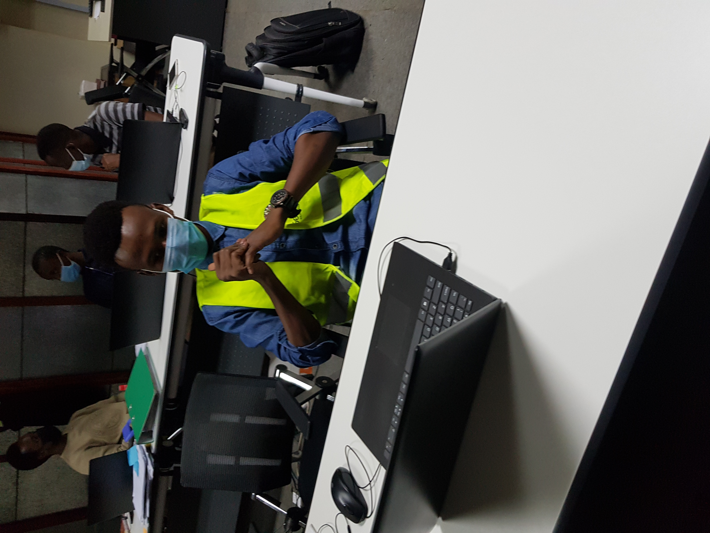
                                        
Break from work

                                    

                                    

                                        
3 / 20

                                        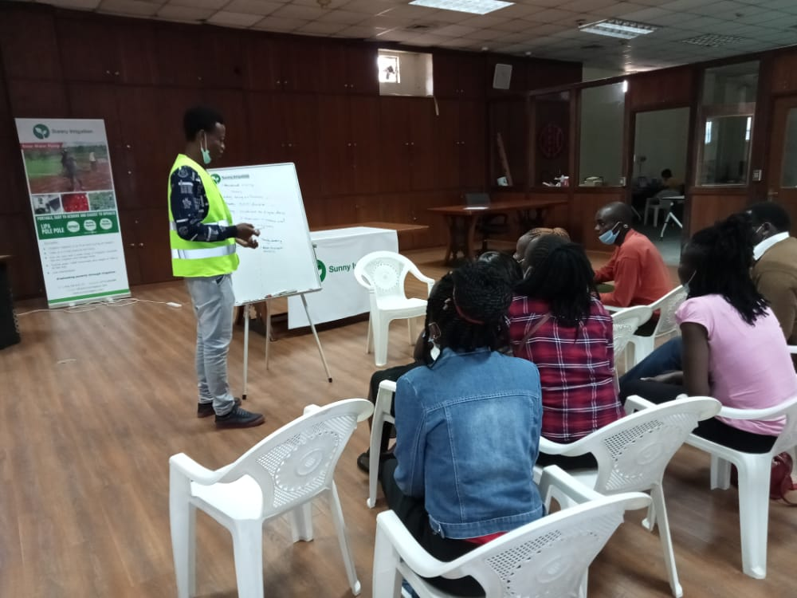
                                        
passing knowledge 

                                    

                                    

                                        
4 / 20

                                        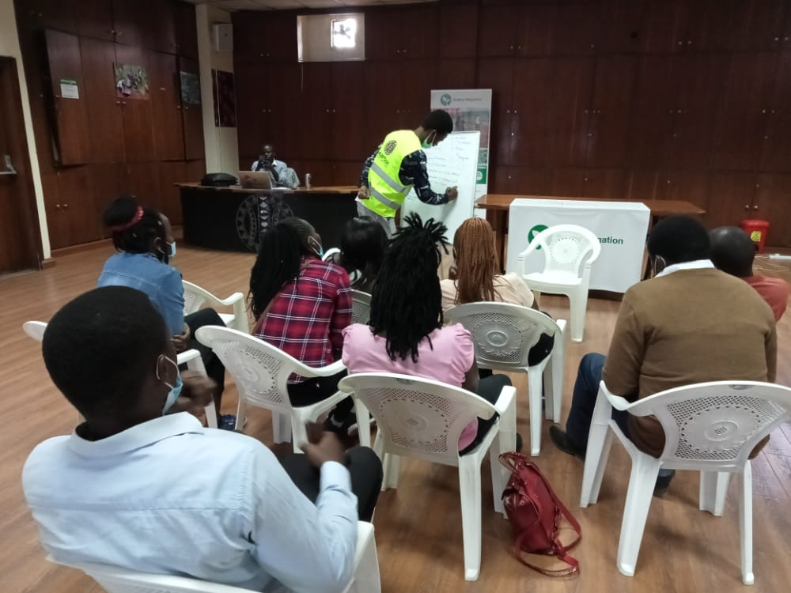
                                        
Teaching

                                    

                                    

                                        
5 / 20

                                        
                                        
 Inventor Drawings

                                    

                                    

                                        
6 / 20

                                        
                                        
3-d view

                                    

                                    

                                        
7 / 20

                                        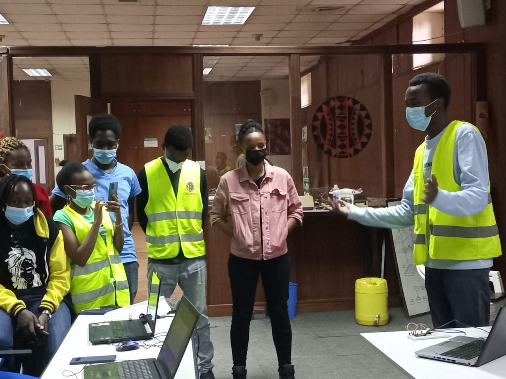
                                        
Presentations

                                    

                                    

                                        
8 / 20

                                        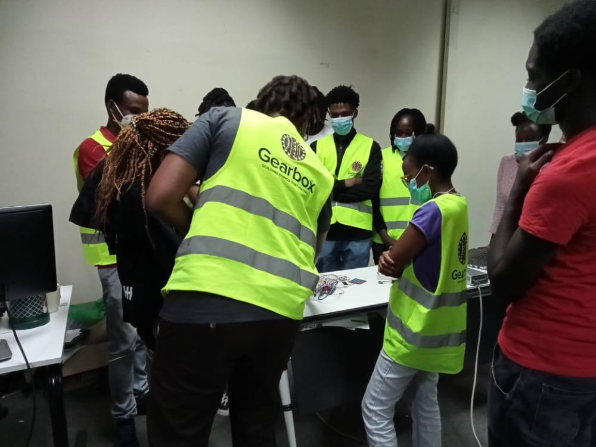
                                        
Team work

                                    

                                    

                                        
9/ 20

                                        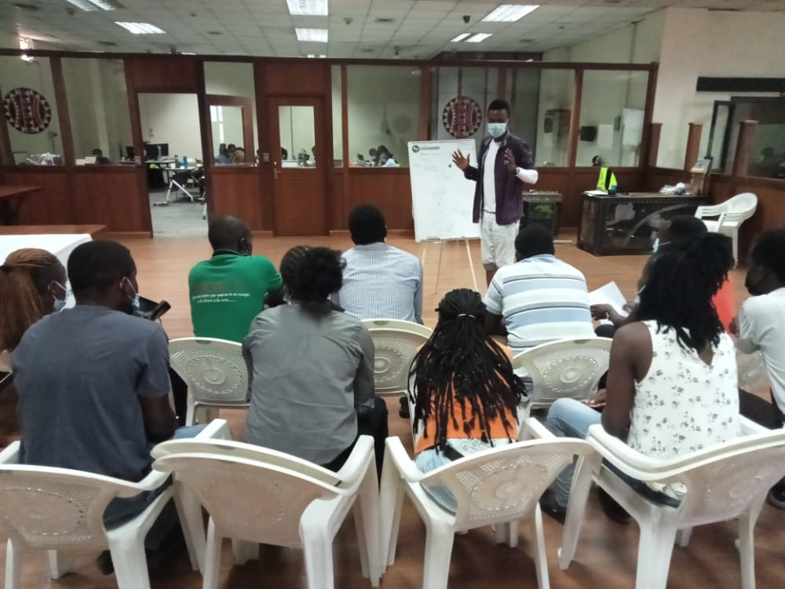
                                        
Team building

                                    

                                    

                                        
10 / 20

                                        
                                        
Corel Descriptive drawings

                                    

                                    

                                        
11 / 20

                                        
                                        
Corel Descriptive drawings

                                    

                                    

                                        
12 / 20

                                        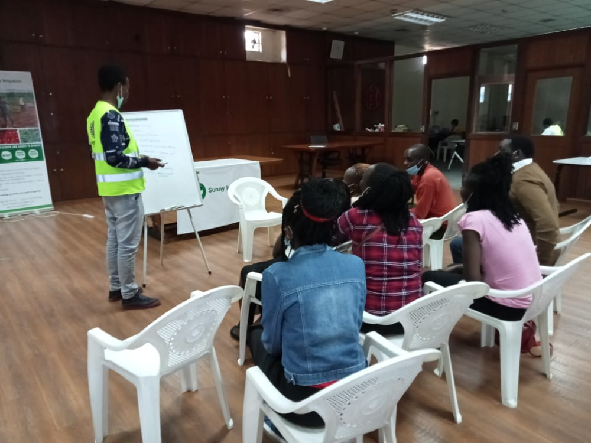
                                        
At work

                                    

                                    

                                        
13 / 20

                                        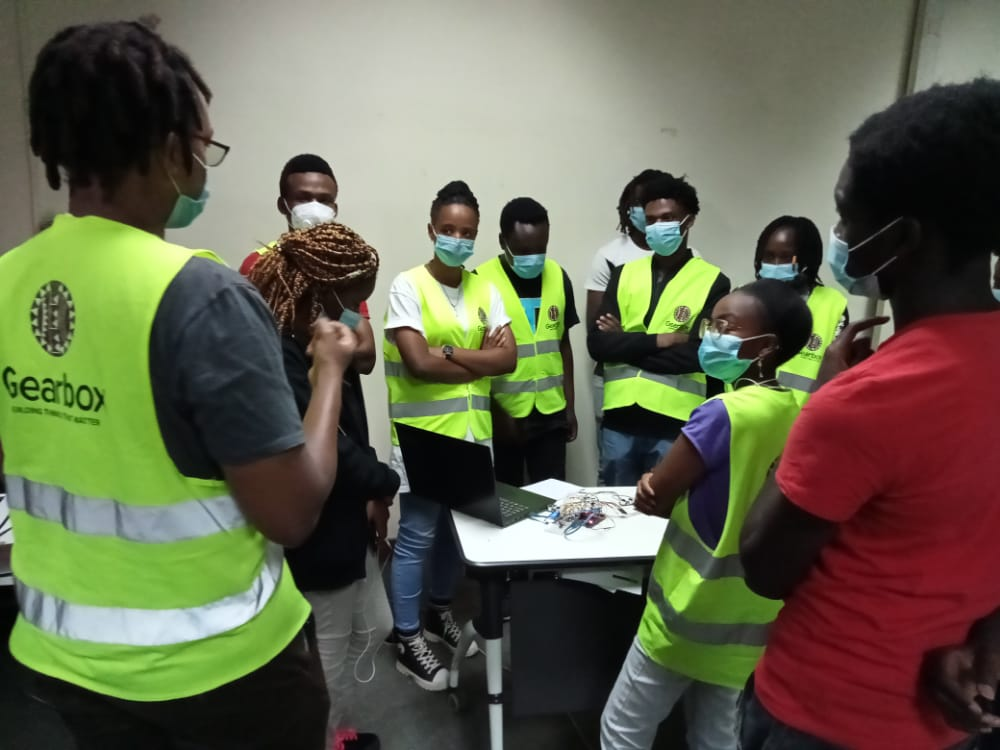
                                        
Teamwork

                                    

                                    

                                        
14 / 20

                                        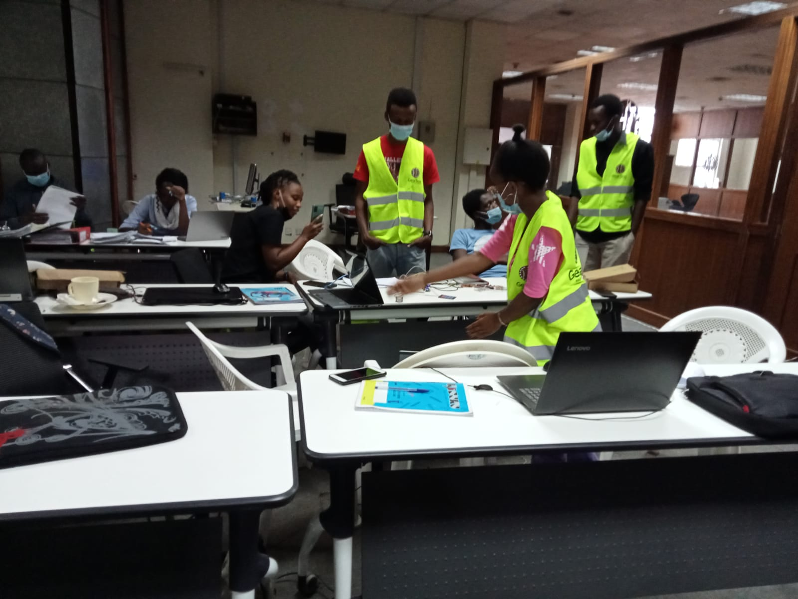
                                        
Be on your feet

                                    

                                    

                                        
15 /20 

                                        
                                        
Corel draw prowess

                                    

                                    

                                        
16 / 20

                                        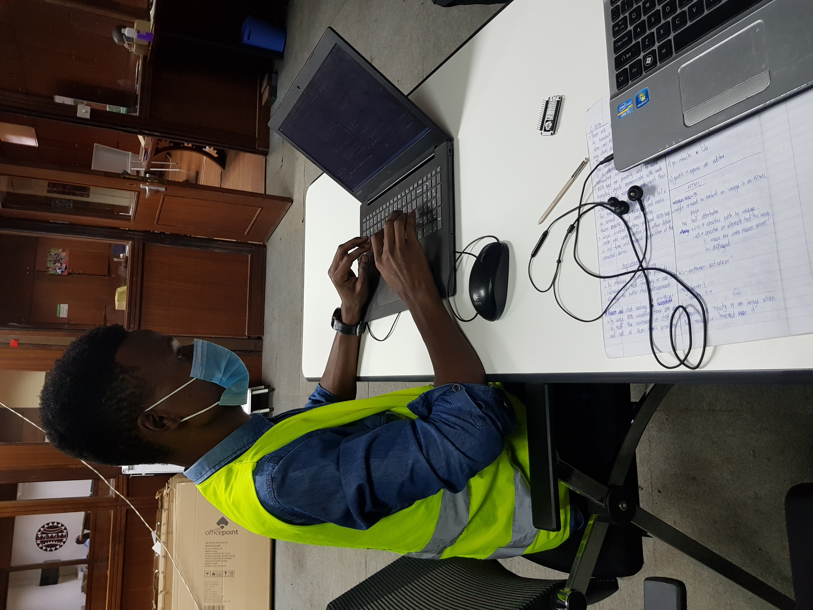
                                        
Corel draw prowess

                                    

                                    

                                        
17 / 20

                                        
                                        
Corel draw prowess

                                    

                                    

                                        
18 / 20

                                        
                                        
Listening

                                    

                                    

                                        
19 / 20

                                        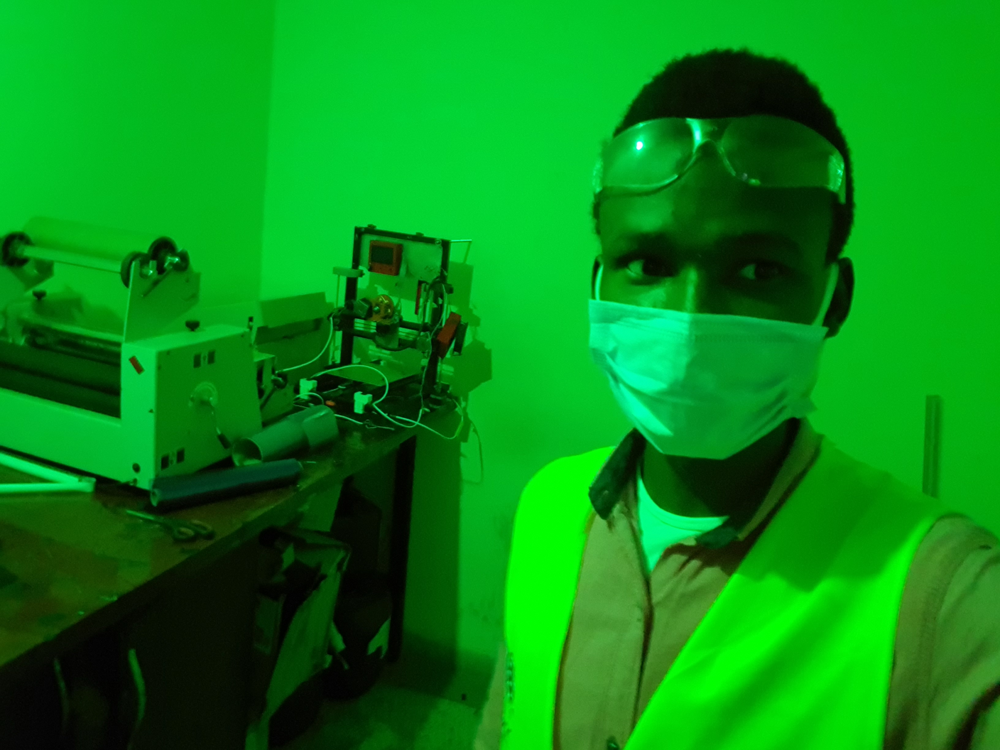
                                        
Making the PCBs

                                    

                                    

                                        
20 / 20

                                        
                                        

                                            Proteus simulation
                                        

                                    

                                

                            

                            

                                
                                
                                
                                
                                
                                
                                
                                
                                
                                
                                
                                
                                
                                
                                
                                
                                
                                
                                
                                

                            

                            

                            <!--  ======================== end added Brand Area ==============================  -->

                            

                                

                                    

                                        <h2 class="p-3 years">1</h2>
                                        <h2>
                                            Year
                                            Experience
                                            Working
                                        </h2>
                                    

                                    

                                        <i class="fas fa-phone-alt fa-3x px-3"></i>
                                        

                                            <a href="#" class="text-uppercase h4 font-roboto">Call Now</a>
                                            (+254)790467583
                                        

                                    

                                    

                                

                            

                        

                    

                </section>

                <!--  ======================== End Brand Area ==============================  -->
                <!--  ====================== Start Services Area =============================  -->

                <section class="services-area">
                    

                        

                            

                                <h1 class="text-uppercase title-text" id="servicesoffer">Services Offers</h1>
                                

                                    Below are the service I offer, this mini-list conatins tech-platforms
                                    that i have interacted with . If you are in need of any such services click the hire me button
                                    or make a call.

                                

                            

                        

                        

                            

                                

                                    

                                        

                                            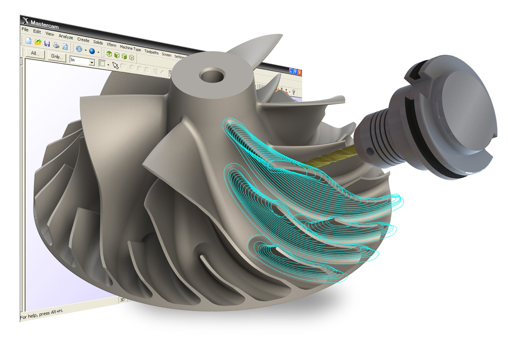
                                        

                                        

                                            <h5 class="card-title text-uppercase font-roboto">Cad & CorelDraw</h5>
                                            

                                                I work with both inventor on technical Cad
                                                drawings and Corel draw for both descriptive
                                                drawings and flow charts
                                            

                                        

                                    

                                

                                

                                    

                                        

                                            
                                        

                                        

                                            <h5 class="card-title text-uppercase font-roboto">Microctroller Prog</h5>
                                            

                                                Involves programing from , arduino, raspberrypi to Atmel AVR's.
                                                This includes automation with different sensors,
                                                actuation devices and platforms like IoT.
                                            

                                        

                                    

                                

                                

                                    

                                        

                                            
                                        

                                        

                                            <h5 class="card-title text-uppercase font-roboto">Electro-Mechanical design</h5>
                                            

                                                Working with different circuitrys with an intent to give a desired logic
                                                to a system.This reduces cyber attacks

                                            

                                        

                                    

                                

                                

                                    

                                        

                                            
                                        

                                        

                                            <h5 class="card-title text-uppercase font-roboto">Web Design</h5>
                                            

                                                Involves webdevelopment, both back and front end programming of websites and
                                                boostrap templates for various desired works.
                                            

                                        

                                    

                                

                            

                        

                    

                </section>

                <!--  ====================== End Services Area =============================  -->
                <!--  ======================= Project Area =============================  -->

                <section class="project-area">
                    

                        

                            <h1 class="text-uppercase title-h1" id="projects">Recently Done Projects</h1>
                            <h1 class="text-uppercase title-h1">Quality Work</h1>
                        

                                        <!--
                         

                        <button type="button" class="active" id="btn1" data-filter="*">All</button>
                        <button type="button" data-filter=".popular">Popular</button>
                        <button type="button" data-filter=".latest">Latest</button>
                        <button type="button" data-filter=".following">Following</button>
                        <button type="button" data-filter=".upcoming">Upcoming</button>
                    

                        ======================= Project gallery Area =============================  -->
                        

                            

                                

                                    
                                        

                                            <h2 class="text-uppercase pt-5">
                                                Touchless faucet
                                                with door control
                                                system for covid
                                            </h2>
                                            

                                                

                                                    As someone approaches an entrance with this mechanism,there is a
                                                    “Please wash your hands” message displayed by the LCD.
                                                    Once the person moves closer to the faucet, the ultrasonic sensor,
                                                    sensing proximity, sends a signal to the servo motor which in turn rotates
                                                    the pump.
                                                

                                                

                                                    As the pump is running, the LCD displays,
                                                    “Washing hands, please wait”, in case there is someone else waiting to enter.
                                                    Once done with hand washing, as the hands are withdrawn,
                                                    the pump shuts off and as a result the LCD displays, “Please proceed” a
                                                    nd the door is opened.
                                                    Open <a href="https://github.com/YvonneMureithi/Touchless-Faucet.git" target="_blank">GitHub</a> for videos ,code and more photos on the working.
                                                

                                            

                                        

                                        

                                            

                                                <a class="test-popup-link" href="./img/portfolio/touchless-faucet.jpg">
                                                    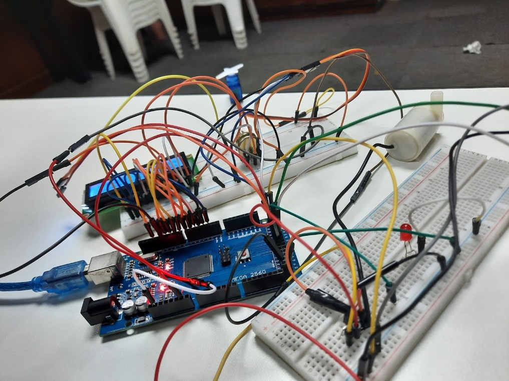
                                                </a>
                                            

                                        

                                   
                                        <!--  ======================= 1 =============================  -->
                                        

                                            <h2 class="text-uppercase pt-5">
                                                Face-Mask ATM 
                                                and 
                                                Reminder

                                            </h2>
                                            

                                                

                                                    The project is a proof of concept of a mask dispensing ATM that can be installed at homes to
                                                    remind people to take a mask before leaving or at the entrance of public facilities. When
                                                    someone comes into close proximity with the dispenser, a buzzer goes off and a text reminding
                                                    one to pick a mask is displayed. One can then pick whatever number of masks they require and
                                                    the buzzer will go off. In case of a low balance of masks, it will notify the user to refill.

                                                

                                                

                                                    One can then pick whatever number of masks they require and
                                                    the buzzer will go off. In case of a low balance of masks,
                                                    it will notify the user to refill.
                                                    Open <a href="https://github.com/r3wnad/Mask-ATM.git" target="_blank">GitHub</a> for videos
                                                    ,code and more photos on the working.
                                                

                                            

                                        

                                        

                                            

                                                <a class="test-popup-link" href="./img/portfolio/20210319_164318.jpg">
                                                    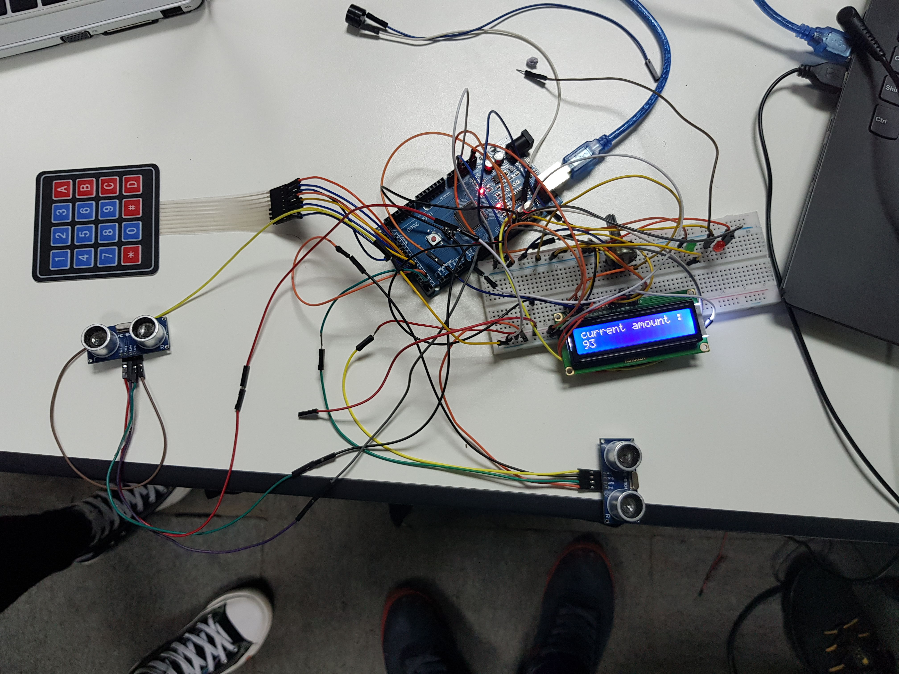
                                                </a>
                                            

                                        

                                        <!--  ======================= 2 =============================  -->
                                        

                                            <h2 class="text-uppercase pt-5">
                                                Simple Pulse
                                                Monitor

                                            </h2>
                                            

                                                

                                                    The pulse sensor module has a light that helps in measuring the
                                                    pulse rate. When we place the finger on the pulse sensor,
                                                    the light reflected will change based on the volume of blood
                                                    inside the capillary blood vessels.
                                                

                                                

                                                    This variation in light transmission
                                                    and reflection can be obtained as a pulse from the output of
                                                    the pulse sensor. This pulse can be then conditioned to
                                                    measure heartbeat and then programmed accordingly
                                                    to read as heartbeat count using Arduino. The heartbeat is then displayed
                                                    on the serial monitor which can later be used as a lie detector.
                                                    Open <a href="#"target="_blank">GitHub</a> for videos
                                                    ,code and more photos on the working.
                                                

                                            

                                        

                                        

                                            

                                                <a class="test-popup-link" href="./img/portfolio/pulse-monitor.jpg">
                                                    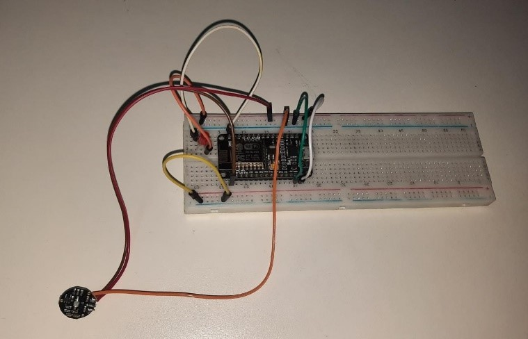
                                                </a>
                                            

                                        

                                        <!--  ======================= 3 =============================  -->
                                        

                                            <h2 class="text-uppercase pt-5">
                                                Stepper Motor 
                                                Control using 
                                                Blyk app
                                            </h2>
                                            

                                                

                                                    Blynk is a platform that allows you to quickly build interfaces
                                                    for controlling and monitoring your hardware projects from your
                                                    iOS and Android device. After downloading the Blynk app, you can
                                                    create a project dashboard and arrange buttons, sliders, graphs,
                                                    and other widgets onto the screen. Using the widgets, you can turn
                                                    pins on and off or display data from sensors.In our project, we are
                                                    going to control a stepper motor using the Blynk application.
                                                

                                                

                                                    In our project, we are
                                                    controlled a stepper motor using the Blynk application. Thiscould be replicated
                                                    to switch a fan in the house on and off. Open <a href="https://github.com/MisiCod/Stepper-control-from-the-phone.git">GitHub</a>
                                                    for videos ,code and more photos on the working.
                                                

                                            

                                        

                                        

                                            

                                                <a class="test-popup-link" href="./img/portfolio/stepper-control.jpg">
                                                    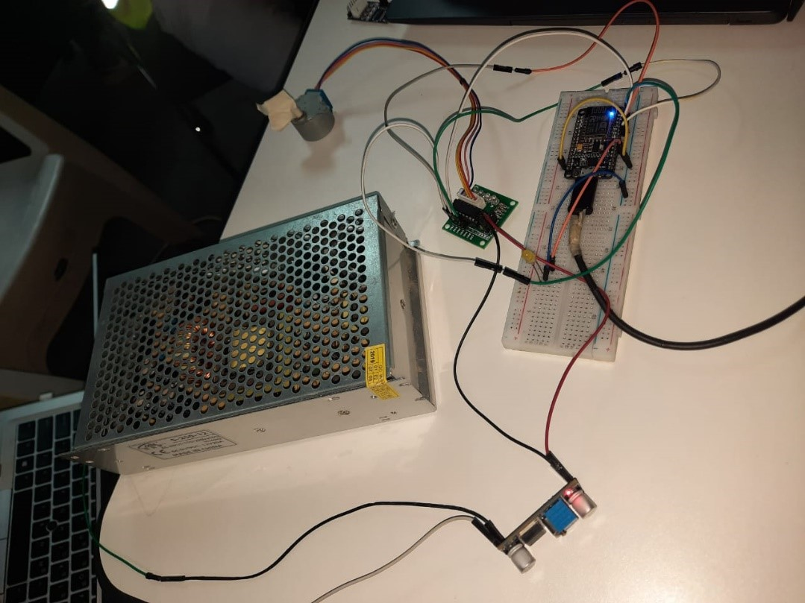
                                                </a>
                                            

                                        

                                        <!--  ======================= 4 =============================  -->
                                        

                                            <h2 class="text-uppercase pt-5">
                                                Voice Controlled
                                                Home Appliances

                                            </h2>
                                            

                                                

                                                    This is a project which is supposed to enable one to control
                                                    home appliances by use of voice commands communicated to the Google Assistant,
                                                    which then prompts the desired actions. In this case, we used voice commands
                                                    to turn an LED on or/ and off. This serves to make work easier,
                                                    and adds convenience, since it can be done remotely.
                                                

                                                
Open <a href="#"target="_blank">GitHub</a> for videos
                                            ,code and more photos on the working.

                                            
 
                                        

                                        

                                            

                                                <a class="test-popup-link" href="./img/portfolio/voice-control.jpg">
                                                    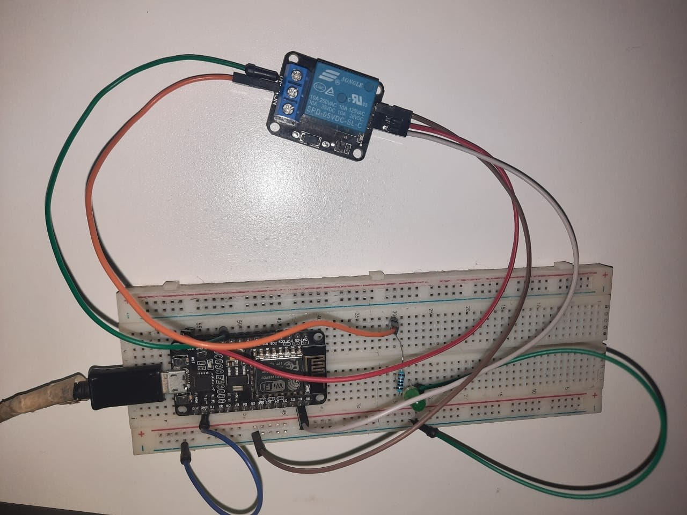
                                                </a>
                                            

                                        

                                        <!--  ======================= 5 =============================  -->
                                        

                                            <h2 class="text-uppercase pt-5">
                                                Automated 
                                                Door System

                                            </h2>
                                            

                                                

                                                    This project involves coming up with a proof-of-concept
                                                    automatic door system that helps reduce coming into contact
                                                    with contaminated surfaces, an example is, a door in a public place
                                                    , most especially during this day and age of Covid-19.
                                                    The door is automated in such a way that it opens once one
                                                    comes within range of the HC-SR04 Ultrasonic sensor.
                                                    Open <a  href="https://github.com/wambui-pixel/Automatic-Door.git" target="_blank">GitHub</a> for videos
                                                    ,code and more photos on the working.
                                                

                                            

                                        

                                        

                                            

                                                <a class="test-popup-link" href="./img/portfolio/automated-door.jpg">
                                                    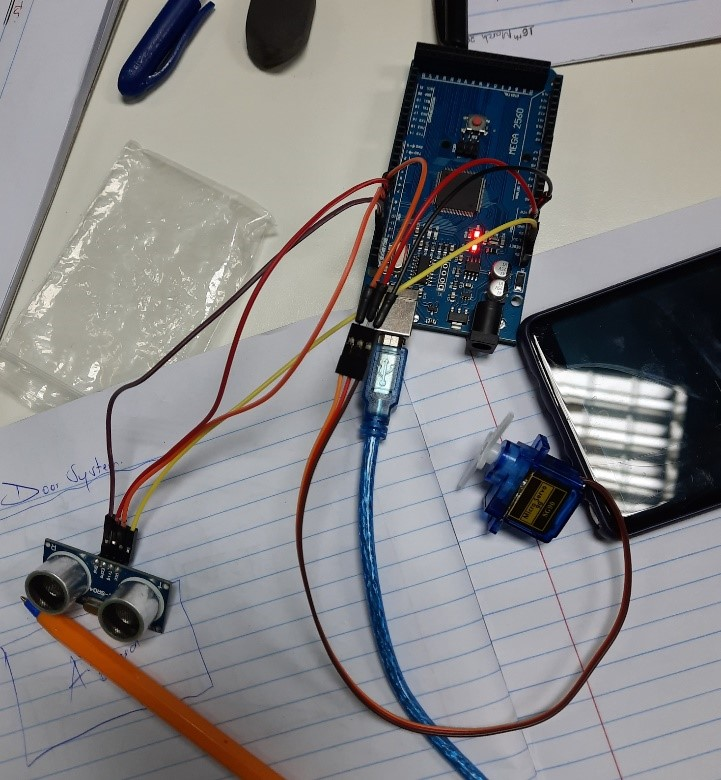
                                                </a>
                                            

                                        

                                        <!--  ======================= 6 =============================  -->
                                        

                                            <h2 class="text-uppercase pt-5">
                                                Automated
                                                Smoke
                                                Detector
                                            </h2>
                                            

                                                

                                                    This smoke detector project is a proof of concept
                                                    that you can be able to capture and send data to the
                                                    cloud from NodeMCU using the Blynk App. It detects
                                                    smoke beyond a set threshold and sends a notification to the Blynk App.
                                                

                                                

                                                    The smoke sensor has been implemented before
                                                    in smoke alarms that go off and automatically;
                                                    trigger fire sprinklers that release water and a smoke alarm,
                                                    to alert the owner. It’s purpose is to save property and
                                                    life from an actual, full-burning fire.
                                                    Open <a href="https://github.com/wambui-pixel/Smoke-detector.git" target="_blank">GitHub</a> for 
                                                    videos ,code and more photos on the working.
                                                

                                            

                                        

                                        

                                            

                                                <a class="test-popup-link" href="./img/portfolio/smoke-detector.jpg">
                                                    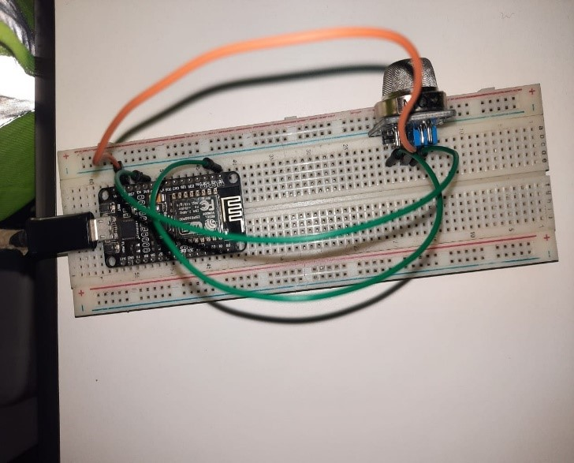
                                                </a>
                                            

                                        

                                        <!--  ======================= 7 =============================  -->

                                    

                                

                        

                    

                </section>            <!--  ======================= End Project Area =============================  -->
                <!--  ======================== Animated About Me Area ==============================  -->

                <section class="aboutme-area">
                    

                        

                            

                                

                                    <h1 class="text-uppercase title-h1" id="referees">Client Say about me</h1>
                                    

                                        Below are people I have both worked with and for .
                                        Get their contacts, details and feedbacks by Clicking either of the tabs.
                                    

                                

                            

                        

                    

                    

                        

                            

                                <h2>Bonyeza either of the names</h2>
                                

                                    <a href="javascript:void(0)" onclick="openCity(event, 'Ngugi');">
                                        
Ngugi

                                    </a>
                                    <a href="javascript:void(0)" onclick="openCity(event, 'Limz');">
                                        
 Limz

                                    </a>
                                    <a href="javascript:void(0)" onclick="openCity(event, 'Alex');">
                                        
Alex

                                    </a>
                                

                                

                                    <h4>Ngugi</h4>
                                    
The general overseer of  Gearbox academy , whom I worked under in my attachemnt at gearbox 

                                    

                                        Comments:
                                        
                                    

                                    

                                        Contact:s
                                    

                                   
                                

                                

                                    <h4>Limo Patrick</h4>
                                    

                                        A brilliant gearbox professional who supervised me on my attachment at gearbox .

                                    

                                    

                                        Comments:
                                        He is consistently willing to view problems as challenges,
                                        as opposed to roadblocks and work with others on
                                        solutions; he has exhibited an ability to come up
                                        with innovative solutions to unexpected problems.

                                    

                                    

                                        Contact:
                                        +254 710504790
                                        limopato254@gmail.com
                                        patrick@gearbox.co.ke
                                    

                                

                                

                                    <h4>Alex Muchiri</h4>
                                    

                                        An advisor and client, aeronautical engineer by profession .Done a few drawings for him that
                                        based majorly on descriptive details of a device or component. This I have done on CorelDraw platform.
                                    

                                    

                                        Comments:
                                        He has met or surpassed his goals and takes pride in his
                                        performance; he is open to ideas and enthusiastic about the
                                        opportunity to learn new skills.

                                    

                                    

                                        Contact:
                                        +254 710504790
                                        alexmuchiri11@gmail.com
                                        
                                    

                                

                            

                        

                        
                    

                </section>

                <!--  ======================== End About Me Area ==============================  -->
                <!--  ========================== Subscribe me Area ============================  -->
                <section class="subscribe-us-area">
                    

                        

                            

                                

                                    <h4 class="text-uppercase">Get Update From anywhere</h4>
                                    

                                        Feel free to drop your email to get updates, on both my career
                                        life and the Tech world.
                                    

                                    <a href="mailto:manuelmisiko2@gmail.com?subject= I wish to inquire on Hiring your services" class="w3-hover-text-blue">
                                    Click here to send me an email!!!</a>
                                

                                

                                    <form class="w-50">
                                        

                                            

                                                <input type="text" id="txtemail" class="form-control" placeholder="Email">
                                            

                                            

                                                

                                                    <button type="submit" class="btn btn-success float-right">Subscribe</button>
                                                

                                            

                                        

                                    </form>
                                

                            

                        

                    

                </section>
        </main>
        
    
    <!--  ========================== End Subscribe me Area ============================  -->
        
        <!--  ======================= End Main Area ================================ -->

        <footer class="footer-area">
            

                

                    

                        
                    

                    

                        <h5 class="text-uppercase">Follow me</h5>
                        <a href="https://www.facebook.com/profile.php?id=100010686276334" target="_blank"><i class="fab fa-facebook"></i></a>
                        <a href="https://www.instagram.com/invites/contact/?i=17tgcpv651gg3&utm_content=15s7pyh" target="_blank"><i class="fab fa-instagram"></i></a>
                        <a href=""><i class="fab fa-linkedin"></i></a>
                        <a href="https://twitter.com/Eng_Misiko?s=08" target="_blank"><i class="fab fa-twitter"></i></a>
                        
                    

                    

                        

                            Copyright ©2021 All rights reserved | This template is made with by
                            <a href="https://github.com/MisiCod" target="_blank">MisiCod</a>
                        

                    

                

            

        </footer>

        <!--  Jquery js file  -->
        

        <!--  Bootstrap js file  -->
        

        <!--  isotope js library  -->
        

        <!--  Magnific popup script file  -->
        

        <!--  Owl-carousel js file  -->
        

        <!--  custom js file  -->
        
        
   
